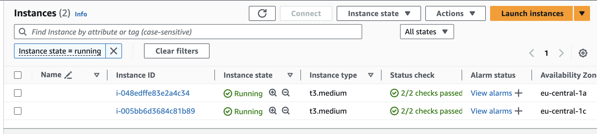
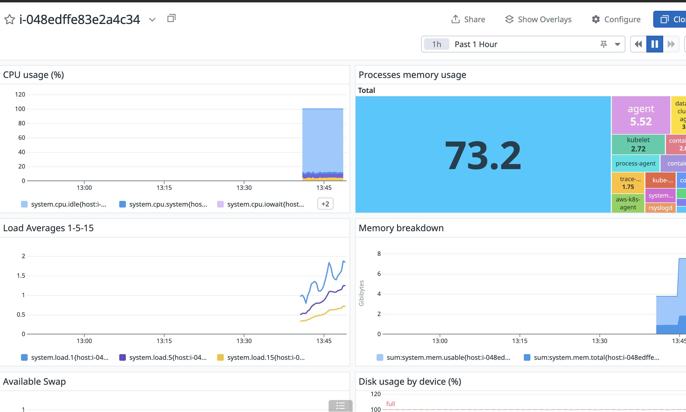

# Datadog Deployment Guide for EKS Cluster on AWS Cloud

## Table of Contents

- [Prerequisites](#prerequisites)
- [Step 1: Create an EKS Cluster](#step-1-create-an-eks-cluster)
- [Step 2: Configure AWS CLI for Cluster Access](#step-2-configure-aws-cli-for-cluster-access)
- [Step 3: Install Datadog Operator using Helm](#step-3-install-datadog-operator-using-helm)
- [Step 4: Configure Datadog API Key](#step-4-configure-datadog-api-key)
- [Step 5: Deploy Datadog Agent](#step-5-deploy-datadog-agent)
- [Step 6: Verify Deployment](#step-6-verify-deployment)
- [Step 7: Create a Test Pod to Load CPU](#step-7-create-a-test-pod-to-load-cpu)
- [Role-Based Access Control](#role-based-access-control)
  - [Step 1: Create a Namespace for External Users](#step-1-create-a-namespace-for-external-users)
  - [Step 2: Set Up Role and RoleBinding for External Users](#step-2-set-up-role-and-rolebinding-for-external-users)
  - [Step 3: Test Role and RoleBinding](#step-3-test-role-and-rolebinding)

## Prerequisites

Before you begin, ensure you have the following tools installed: *Docker*, *Helm*, and *KubeCTL*. Additionally, create a trial account on [Datadog](https://www.datadoghq.com/). This trial is valid for **14** days.

## Step 1: Create an EKS Cluster

Create an EKS cluster through the AWS Management Console. You can use the default settings for simplicity. Once the cluster is created, set up a node group. Again, the default settings should suffice.


## Step 2: Configure AWS CLI for Cluster Access

Log in to your EKS cluster using the AWS CLI:

`aws eks --profile your_aws_profile --region your_region update-kubeconfig --name your_cluster_name`

  **Note:** Replace `your_aws_profile`, `your_region`, and `your_cluster_name` with your actual AWS profile, region, and cluster name.

## Step 3: Install Datadog Operator using Helm

Add the Datadog Helm repository and install the Datadog Operator:

```bash
helm repo add datadog https://helm.datadoghq.com
```

```bash
helm install datadog-operator datadog/datadog-operator
```

This will deploy the Datadog Operator, which is required to manage the Datadog agents across your Kubernetes cluster.

## Step 4: Configure Datadog API Key

Create a Kubernetes secret to store your Datadog API key:

`kubectl create secret generic datadog-secret --from-literal api-key=your_datadog_api_key`

   **Note:** Replace `your_datadog_api_key` with your actual Datadog API key.

This step secures your API key within Kubernetes, allowing the Datadog agent to authenticate with the Datadog service.

## Step 5: Deploy Datadog Agent

Create a `datadog-agent.yaml` file with the following content:

```yaml
apiVersion: datadoghq.com/v2alpha1
kind: DatadogAgent
metadata:
  name: datadog
spec:
  global:
    site: datadoghq.eu #optional if your deployment fails
    credentials:
      apiSecret:
        secretName: datadog-secret
        keyName: api-key
```

Apply the configuration to deploy the Datadog Agent:

```bash
kubectl apply -f datadog-agent.yaml
```

This deployment enables Datadog to start monitoring your EKS cluster by collecting metrics, logs, and traces.

## Step 6: Verify Deployment

To confirm that Datadog is properly installed and monitoring your EKS cluster, check the Datadog UI. You should see your hosts listed and active metrics being reported.


## Step 7: Create a Test Pod to Load CPU

Create a simple pod to generate CPU load and observe the metrics in Datadog. Use the following YAML configuration:

```yaml
apiVersion: v1
kind: Pod
metadata:
  name: cpu-load-test
  namespace: default
spec:
  containers:
  - name: cpu-load
    image: busybox
    command:
    - sh
    - -c
    - "while true; do :; done"
  restartPolicy: Never
```

Apply the configuration:

```bash
kubectl apply -f cpu-load-test.yaml
```

This pod will continuously load the CPU, allowing you to check the corresponding metrics in the Datadog UI.



****

# Role-Based Access Control

In this section, you'll set up Role-Based Access Control (RBAC) for external users in your Kubernetes cluster.

## Step 1: Create a Namespace for External Users

Create a new namespace for external users:

```bash
kubectl create namespace external-user
```

## Step 2: Set Up Role and RoleBinding for External Users

- Create RoleBinding:
  - Create a rolebinding.yaml file with the following content:

```yaml
apiVersion: rbac.authorization.k8s.io/v1
kind: RoleBinding
metadata:
  name: external-user-rolebinding
  namespace: external-user
subjects:
- kind: User
  name: external-user
  apiGroup: rbac.authorization.k8s.io
roleRef:
  kind: Role
  name: external-user-role
  apiGroup: rbac.authorization.k8s.io
```

- Create Role:
  - Create a role.yaml file with the following content:

```yaml
apiVersion: rbac.authorization.k8s.io/v1
kind: Role
metadata:
  namespace: external-user
  name: external-user-role
rules:
- apiGroups: [""]
  resources: ["pods"]
  verbs: ["get", "list", "watch", "create", "delete"]
```

- Apply both Role and RoleBinding in one command:

```bash
kubectl apply -f role.yaml,rolebinding.yaml
```

## Step 3: Test Role and RoleBinding

To test if the Role and RoleBinding are correctly set up, you can switch to user itself or use the kubectl auth can-i command:

```bash
kubectl auth can-i get pods --namespace=external-user --as=external-user
```

Should return "yes"

```bash
kubectl auth can-i get pods --namespace=default --as=external-user
```

Should return "no"

```bash
kubectl auth can-i get secret --namespace=external-user --as=external-user
```

Should return "no"

If everything is set up correctly, the external user should only have access to manipulate pods in the external-user namespace.
